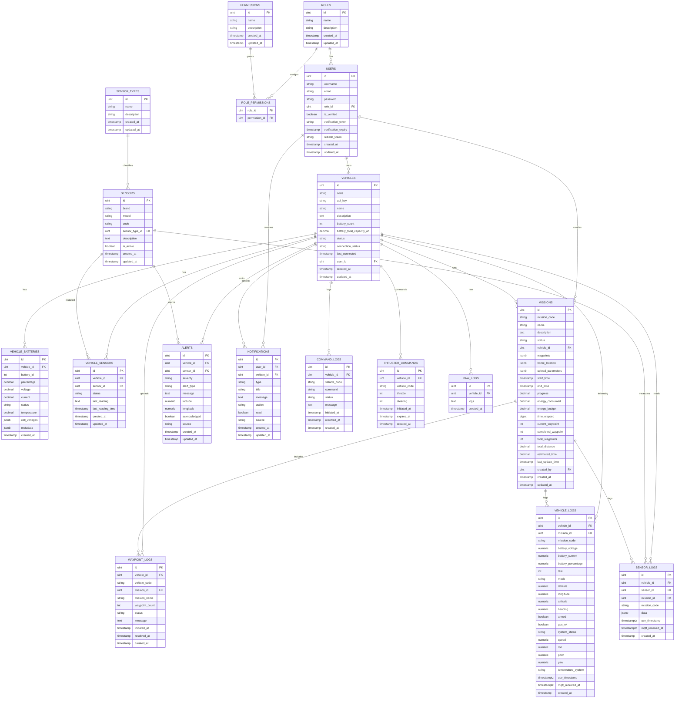

# Go Fiber PostgreSQL API

Complete API with JWT authentication, email verification, CRUD operations, and **real-time sensor data integration via MQTT and WebSocket**.

## Database Schema



## Features

- 🔐 JWT Authentication & Email Verification
- 👥 User Management with Role-Based Access Control (RBAC)
- 🚢 Vehicle & Sensor Management
- 📡 **Real-time Sensor Data via MQTT & WebSocket**
- 🌊 **CTD Sensor Integration (Extensible for Multiple CTD Types)**
- 📊 Sensor Data Logging & Query API
- 📝 API Documentation (Swagger)
- 🐳 Docker Support

## Architecture

### System Overview

```
┌─────────────┐
│     USV     │  ← Unmanned Surface Vehicle
│  (Vehicle)  │
└──────┬──────┘
       │ MQTT Publish
       │ Topic: seano/{vehicle_code}/{sensor_code}/{sensor_type}
       ↓
┌─────────────┐
│ MQTT Broker │
│ (Mosquitto) │
└──────┬──────┘
       │ Subscribe
       ↓
┌──────────────────┐
│  MQTT Listener   │  ← Go Service (cmd/mqtt-listener)
│  • Parse JSON    │
│  • Validate Data │
│  • Store to DB   │
│  • Broadcast WS  │
└──────┬───────────┘
       │
       ├─→ PostgreSQL (sensor_logs)
       │
       └─→ WebSocket Hub
              │
              ↓
       ┌──────────────────┐
       │ Connected Clients│
       │  (Dashboard)     │
       │  • React/Vue/etc │
       │  • Real-time UI  │
       └──────────────────┘
```

## Quick Start

### 1. Clone & Install Dependencies

```bash
git clone <repository>
cd go-fiber-pgsql
go mod download
```

### 2. Setup Database

```bash
# Create PostgreSQL database
createdb go_fiber_db

# Set environment variables
cp .env.example .env
# Edit .env with your database credentials
```

### 3. Run Migration

```bash
docker compose exec backend go run cmd/migrate/main.go
```

### 4. Start API Server

```bash
go run cmd/server/main.go
```

Server will run on `http://localhost:3000`
Swagger docs: `http://localhost:3000/swagger`

### 5. Start MQTT Listener (for Real-time Sensor Data)

```bash
# In another terminal
export MQTT_BROKER_URL="tcp://localhost:1883"
export MQTT_TOPIC_PREFIX="seano"

go run cmd/mqtt-listener/main.go
```

## Real-time Data Paths (MQTT vs API)

Detail alur realtime ada di [backend/README-REALTIME.md](backend/README-REALTIME.md).

This backend supports two real-time paths:

### 1) MQTT (USV publishes topics)

USV publishes to MQTT topics. The backend listens, saves to DB, then broadcasts to WebSocket.

**Topics consumed by backend:**

```
seano/{vehicle_code}/telemetry                # vehicle log
seano/{vehicle_code}/{sensor_code}/data      # sensor log
seano/{vehicle_code}/raw                      # raw log (text/JSON)
seano/{vehicle_code}/battery                  # battery status
seano/{vehicle_code}/status                   # LWT online/offline
seano/{vehicle_code}/mission/waypoint_reached # mission progress
seano/{vehicle_code}/antitheft/alert          # alert (anti-theft)
seano/{vehicle_code}/failsafe/alert           # alert (failsafe)
seano/{vehicle_code}/alert                    # general alert (GPS, sensor, system, dll)
```

**Topics published by backend (command/missions):**

```
seano/{vehicle_code}/command                  # control command to USV
seano/{vehicle_code}/ack                      # USV replies ACK here
seano/{vehicle_code}/mission                  # mission upload to USV
```

**WebSocket streams (all share the same hub):**

```
WS /ws/logs       # vehicle_log, sensor_log, raw_log, command_log, waypoint_log, battery, vehicle_status
WS /ws/alerts     # alert + alert_update
WS /ws/missions   # mission_progress + mission_update
```

### 2) API (HTTP ingestion + frontend polling)

If USV cannot use MQTT, it can send logs directly via REST API (JWT required):

```
POST /vehicle-logs
POST /sensor-logs
POST /raw-logs
POST /command-logs
POST /waypoint-logs
```

**Catatan (API bisa pakai ID atau code):**

- `POST /vehicle-logs` bisa pakai `vehicle_id` atau `vehicle_code` di body.
- `POST /sensor-logs` bisa pakai `vehicle_id`/`vehicle_code` dan `sensor_id`/`sensor_code` di body.
- `POST /command-logs` dan `POST /waypoint-logs` memakai `vehicle_id` dan `vehicle_code` di body.
- `POST /raw-logs` hanya memakai `logs` (tanpa vehicle_id pada request).

Jika mau lookup ID dari code:

- `GET /vehicles` (ambil `id` dari `code`)
- `GET /sensors/code/:code` (ambil `id` dari `sensor_code`)

**Contoh payload API:**

```json
POST /sensor-logs
{
  "vehicle_code": "USV-01",
  "sensor_code": "CTD-MIDAS-01",
  "data": "{\"temperature\":25.5,\"pressure\":1013}"
}
```

```json
POST /vehicle-logs
{
  "vehicle_code": "USV-01",
  "latitude": -6.2088,
  "longitude": 106.8456,
  "speed": 5.2,
  "heading": 90.5,
  "battery_voltage": 12.5
}
```

When the frontend is set to API mode, it polls these endpoints for real-time updates:

```
GET /vehicle-logs
GET /sensor-logs
GET /raw-logs
GET /command-logs
GET /waypoint-logs
GET /alerts
GET /missions
GET /vehicle-batteries/latest
GET /vehicles/connection-statuses
```

**Frontend env (realtime mode):**

```
VITE_REALTIME_MODE=mqtt   # mqtt or api
VITE_REALTIME_POLL_INTERVAL_MS=5000
```

## Sensor Integration

### Supported Sensor Types

#### CTD (Conductivity, Temperature, Depth) Sensors

**Currently Implemented:**

- ✅ **CTD MIDAS 3000** (`ctd_midas3000`)

**Easily Add More:**

- CTD Seabird SBE series
- CTD RBR Concerto/Solo
- Custom CTD sensors

The system uses a **flexible architecture** that allows adding different CTD sensor types with different data formats without changing the core infrastructure.

### MQTT Topics

Each sensor type has its own topic:

```
seano/{vehicle_code}/{sensor_code}/midas3000  ← CTD MIDAS 3000
seano/{vehicle_code}/{sensor_code}/seabird    ← CTD Seabird (future)
seano/{vehicle_code}/{sensor_code}/rbr        ← CTD RBR (future)
```

### Example: CTD MIDAS 3000 Data

```json
{
  "timestamp": "2025-01-01T08:30:00Z",
  "vehicle_code": "USV-01",
  "sensor_code": "CTD-MIDAS-01",
  "depth": 25.4,
  "pressure": 2.53,
  "temperature": 27.6,
  "conductivity": 53.2,
  "salinity": 33.8,
  "density": 1024.5,
  "sound_velocity": 1508.3
}
```

### WebSocket Real-Time Data

Connect to WebSocket for real-time sensor updates:

```javascript
const ws = new WebSocket(
  "ws://localhost:3000/ws/sensor-data?token=YOUR_JWT_TOKEN",
);

// Subscribe with filters
ws.onopen = () => {
  ws.send(
    JSON.stringify({
      type: "subscribe",
      vehicle_code: "USV-01", // Optional: specific vehicle
      sensor_code: "CTD-MIDAS-01", // Optional: specific sensor
      sensor_type: "ctd_midas3000", // Optional: specific type
    }),
  );
};

// Receive real-time data
ws.onmessage = (event) => {
  const data = JSON.parse(event.data);
  console.log("Real-time:", data.sensor_type, data.data);
  // Update your dashboard/charts
};
```

**WebSocket Message Format:**

```json
{
  "message_type": "sensor_data",
  "sensor_type": "ctd_midas3000",
  "vehicle_code": "USV-01",
  "sensor_code": "CTD-MIDAS-01",
  "timestamp": "2025-01-01T08:30:00Z",
  "data": {
    /* sensor data */
  }
}
```

### REST API for Sensor Logs

```bash
# Get sensor logs with filters
GET /sensor-logs?vehicle_code=USV-01&sensor_code=CTD-MIDAS-01&limit=50

# Get latest reading
GET /sensor-logs/USV-01/CTD-MIDAS-01/latest

# WebSocket stats
GET /ws/stats
```

## API Endpoints

### Authentication

- `POST /auth/register-email` - Register new user
- `POST /auth/verify-email` - Verify email
- `POST /auth/set-credentials` - Set username/password
- `POST /auth/login` - Login
- `POST /auth/refresh` - Refresh token
- `GET /auth/me` - Get current user

### Users

- `GET /users` - Get all users
- `GET /users/:id` - Get user by ID
- `PUT /users/:id` - Update user
- `DELETE /users/:id` - Delete user

### Vehicles

- `POST /vehicles` - Create vehicle
- `GET /vehicles` - Get all vehicles
- `GET /vehicles/:id` - Get vehicle by ID
- `PUT /vehicles/:id` - Update vehicle
- `DELETE /vehicles/:id` - Delete vehicle

### Sensors

- `POST /sensors` - Create sensor (admin)
- `GET /sensors` - Get all sensors
- `GET /sensors/:id` - Get sensor by ID
- `GET /sensors/code/:code` - Get sensor by code

### Vehicle-Sensor Assignment

- `POST /vehicles/:id/sensors` - Assign sensor to vehicle
- `GET /vehicles/:id/sensors` - Get vehicle's sensors
- `DELETE /vehicles/:id/sensors/:sensor_id` - Remove sensor

### Sensor Logs

- `GET /sensor-logs` - Get logs with filters
- `GET /sensor-logs/:vehicle_code/:sensor_code/latest` - Get latest log
- `DELETE /sensor-logs/cleanup` - Delete old logs (admin)

### WebSocket

- `WS /ws/sensor-data` - Real-time sensor data stream
- `GET /ws/stats` - WebSocket connection stats

## Adding New CTD Sensor Types

The system is designed to easily support different CTD sensor types with different data formats:

### 1. Create New Sensor Package

```
internal/service/ctd/<sensor_name>/
├── model.go          ← Define data structure
├── handler.go        ← Process & validate data
├── processor.go      ← Implement SensorDataProcessor interface
├── mqtt_listener.go  ← MQTT handler
└── README.md         ← Documentation
```

### 2. Implement SensorDataProcessor Interface

```go
type SensorDataProcessor interface {
    GetSensorType() string  // e.g., "ctd_seabird"
    ValidateData(data interface{}) error
    ProcessData(vehicleCode, sensorCode string, data interface{}) error
    TransformForBroadcast(data interface{}) (interface{}, error)
}
```

### 3. Register in Main

```go
// Initialize handler
seabirdHandler := seabird.NewDataHandler(sensorLogRepo, vehicleSensorRepo, wsHub)
seabirdProcessor := seabird.NewProcessor(seabirdHandler)

// Register processor
sensorRegistry.Register(seabirdProcessor)

// Create MQTT listener
seabirdListener, _ := seabird.NewMQTTListener(config, seabirdHandler)
seabirdListener.Connect()
seabirdListener.Subscribe() // Topic: seano/+/+/seabird
```

### Benefits

- ✅ **Flexible**: Each sensor type has its own data format
- ✅ **Isolated**: Separate validation logic per sensor
- ✅ **Centralized**: All data stored in same `sensor_logs` table (JSONB)
- ✅ **Scalable**: Add new types without changing infrastructure
- ✅ **Real-time**: All types broadcast via same WebSocket

See [ADDING_CTD_SENSORS.md](ADDING_CTD_SENSORS.md) for detailed implementation guide.

## Testing

### Test MQTT Publishing

```bash
# Install mosquitto clients
sudo apt-get install mosquitto-clients

# Publish test data
mosquitto_pub -h localhost -p 1883 \
  -t "seano/USV-01/CTD-MIDAS-01/midas3000" \
  -m '{
    "timestamp": "2025-01-01T08:30:00Z",
    "vehicle_code": "USV-01",
    "sensor_code": "CTD-MIDAS-01",
    "depth": 25.4,
    "pressure": 2.53,
    "temperature": 27.6,
    "conductivity": 53.2,
    "salinity": 33.8,
    "density": 1024.5,
    "sound_velocity": 1508.3
  }'
```

### Test WebSocket Connection

```bash
# Install websocat
cargo install websocat

# Connect to WebSocket
websocat "ws://localhost:3000/ws/sensor-data?token=YOUR_JWT_TOKEN"

# Send filter
{"type":"subscribe","vehicle_code":"USV-01"}
```

## Docker Deployment

```bash
# Build and run with Docker Compose
docker compose up -d --build

# Run migration
docker compose exec api go run cmd/migrate/main.go

# View logs
docker compose logs -f api
```

## Environment Variables

```env
# Database
DB_HOST=localhost
DB_PORT=5432
DB_USER=postgres
DB_PASSWORD=your_password
DB_NAME=go_fiber_db

# JWT
JWT_SECRET=your-secret-key
JWT_EXPIRATION=24h
REFRESH_TOKEN_EXPIRATION=168h

# Email (for verification)
SMTP_HOST=smtp.gmail.com
SMTP_PORT=587
SMTP_USERNAME=your-email@gmail.com
SMTP_PASSWORD=your-app-password
EMAIL_FROM=noreply@yourapp.com

# MQTT
MQTT_BROKER_URL=tcp://localhost:1883
MQTT_USERNAME=
MQTT_PASSWORD=
MQTT_CLIENT_ID=midas3000-listener
MQTT_TOPIC_PREFIX=seano
```

## Documentation

- [SENSOR_INTEGRATION.md](SENSOR_INTEGRATION.md) - Complete sensor integration guide
- [ADDING_CTD_SENSORS.md](ADDING_CTD_SENSORS.md) - How to add new CTD sensor types
- [WEBSOCKET_API.md](WEBSOCKET_API.md) - WebSocket API documentation
- API Documentation: `http://localhost:3000/swagger`

## Development

### Regenerate Swagger Docs

```bash
cd /home/almus2610/go-fiber-pgsql
~/go/bin/swag init -g cmd/server/main.go -o docs
```

### Run Migration

```bash
go run cmd/migrate/main.go
```

### Docker Commands

```bash
# Rebuild and restart
docker compose up -d --build

# Execute migration in container
docker compose exec api go run cmd/migrate/main.go

# Restart API
docker compose restart api
```

## Project Structure

```
.
├── cmd/
│   ├── server/          ← Main API server
│   ├── migrate/         ← Database migration
│   └── mqtt-listener/   ← MQTT listener for sensors
├── internal/
│   ├── config/          ← Database configuration
│   ├── handler/         ← HTTP handlers
│   ├── middleware/      ← Auth & permission middleware
│   ├── model/           ← Database models
│   ├── repository/      ← Database operations
│   ├── route/           ← API routes
│   ├── service/
│   │   ├── ctd/
│   │   │   └── midas3000/  ← CTD MIDAS 3000 implementation
│   │   └── sensor/      ← Sensor registry & interface
│   ├── util/            ← Utilities (JWT, email)
│   └── websocket/       ← WebSocket hub & handler
├── docs/                ← Swagger documentation
├── .env                 ← Environment variables
├── docker-compose.yml   ← Docker configuration
└── README.md
```

## Tech Stack

- **Go** 1.21+
- **Fiber** v2 - Web framework
- **GORM** - ORM
- **PostgreSQL** - Database
- **JWT** - Authentication
- **MQTT** (Paho) - IoT messaging
- **WebSocket** - Real-time communication
- **Swagger** - API documentation
- **Docker** - Containerization

## License

MIT
